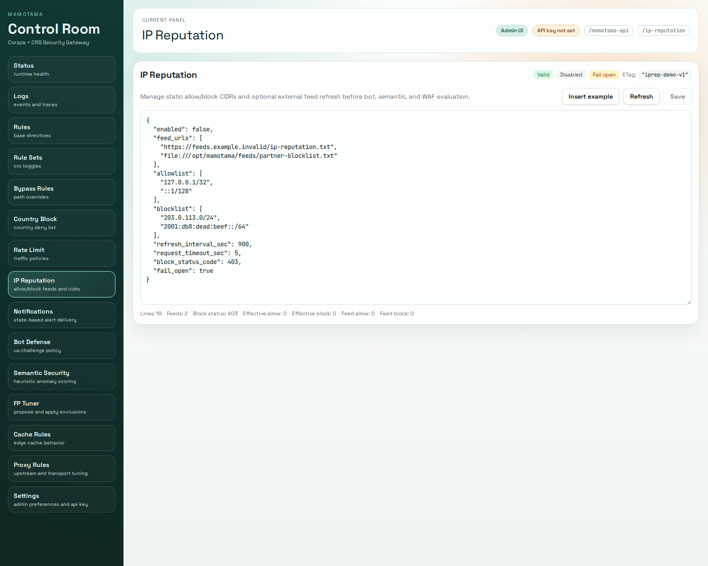

# mamotama

Coraza + CRS WAFプロジェクト

[English](README.md) | [日本語](README.ja.md)


## 概要

このプロジェクトは、Coraza WAF と OWASP Core Rule Set (CRS) を組み合わせた
軽量かつ強力なアプリケーション防御システム「mamotama」です。

---

## ルールファイルについて

本リポジトリには、ライセンス順守のため OWASP CRS 本体は同梱していません。  
代わりに、初期状態で動作可能な最小ベースルール `data/rules/mamotama.conf` を同梱しています。

### セットアップ手順

以下のコマンドで CRS を取得・配置してください（デフォルト: `v4.23.0`）。

```bash
./scripts/install_crs.sh
```

バージョン指定例:

```bash
./scripts/install_crs.sh v4.23.0
```

`data/rules/crs/crs-setup.conf` は必要に応じて編集してください（`Paranoia Level` や `anomaly` スコアなど）。

---

## 環境変数

`.env` は Docker 実行差分のみを管理します。

### Docker / ローカル MySQL（任意）

| 変数名 | 例 | 説明 |
| --- | --- | --- |
| `MYSQL_PORT` | `13306` | MySQL コンテナ `3306` に割り当てるホスト側ポート（`mysql` profile 有効時）。 |
| `MYSQL_DATABASE` | `mamotama` | ローカル MySQL コンテナで初期作成するDB名。 |
| `MYSQL_USER` | `mamotama` | ローカル MySQL コンテナで作成するアプリ用ユーザー。 |
| `MYSQL_PASSWORD` | `mamotama` | `MYSQL_USER` のパスワード。 |
| `MYSQL_ROOT_PASSWORD` | `mamotama-root` | ローカル MySQL コンテナの root パスワード。 |
| `MYSQL_TZ` | `UTC` | コンテナのタイムゾーン。 |

### Coraza アプリ設定（`data/conf/config.json`）

実行時設定は JSON に集約されています（`edge` と同じ方向性）。

- `.env` は Docker 実行差分（UID/GID、ホストポート、mysql profile、設定ファイルパス）だけを保持します。
- Coraza 本体の挙動（server/admin/security/storage/fp-tuner/paths）は `data/conf/config.json` で管理します。
- `data/conf/proxy.json` は引き続き、Proxy転送設定の専用JSONとして運用します。

`config.json` の主なブロック:

| ブロック | 役割 |
| --- | --- |
| `server` | 待受、タイムアウト、ヘッダ上限、同時処理上限、任意の built-in TLS listener |
| `runtime` | Goランタイム制御（`gomaxprocs`、`memory_limit_mb`） |
| `admin` | API/UIベースパス、APIキー、CORS、strict/insecure設定 |
| `paths` | rules/bypass/country/rate/bot/semantic/CRS/proxy のファイルパス |
| `proxy` | `/proxy-rules:rollback` の履歴保持数 |
| `crs` | CRS有効化フラグ |
| `fp_tuner` | モード、接続先、認証、タイムアウト、承認、監査 |
| `storage` | `file|db`、DBドライバ、dsn/path、保持、同期間隔 |

コンテナ起動時に使う環境変数は最小化:

| 変数名 | 例 | 説明 |
| --- | --- | --- |
| `WAF_CONFIG_FILE` | `conf/config.json` | 起動時に読み込むアプリ設定JSON。 |
| `WAF_LISTEN_PORT` | `9090` | Composeのポート/healthcheck/GoTestWAF用。`config.json` の `server.listen_addr` と揃えてください。 |

#### 任意: Built-in TLS 終端

`[proxy]` は `data/conf/config.json` から直接 HTTPS 待受できます。listener 証明書は config-only で、admin UI からの編集はありません。

```json
"server": {
  "listen_addr": ":9443",
  "tls": {
    "enabled": true,
    "cert_file": "/etc/mamotama/tls/fullchain.pem",
    "key_file": "/etc/mamotama/tls/privkey.pem",
    "min_version": "tls1.2",
    "redirect_http": true,
    "http_redirect_addr": ":9080"
  }
}
```

- 既定値は `server.tls.enabled=false` です。
- 手動証明書ファイル（`cert_file` / `key_file`）は引き続き利用できます。
- ACME は `server.tls.acme.enabled=true` と `server.tls.acme.email`, `server.tls.acme.domains`, `server.tls.acme.cache_dir`、必要なら `server.tls.acme.staging=true` で有効化できます。
- `server.tls.redirect_http=true` にすると、別の plain HTTP listener を起動して HTTPS へ permanent redirect します。
- ACME と `server.tls.redirect_http=true` を併用した場合、plain HTTP listener は `/.well-known/acme-challenge/` を処理し、それ以外を HTTPS へ redirect します。
- `server.tls.http_redirect_addr` は `server.listen_addr` と別アドレスにしてください。

TLS 証明書の選択は host/path routing より前、つまり TLS handshake の段階で決まります。`routes[].match.hosts` が証明書を切り替えるわけではなく、listener 側の証明書または ACME/SNI の結果が、その host を事前にカバーしている必要があります。

例: exact host routing を ACME で運用する場合

```json
"server": {
  "listen_addr": ":443",
  "tls": {
    "enabled": true,
    "min_version": "tls1.2",
    "redirect_http": true,
    "http_redirect_addr": ":80",
    "acme": {
      "enabled": true,
      "email": "ops@example.com",
      "domains": ["api.example.com", "admin.example.com"],
      "cache_dir": "/var/lib/mamotama/acme"
    }
  }
}
```

例: wildcard host routing を手動 wildcard 証明書で運用する場合

```json
"server": {
  "listen_addr": ":443",
  "tls": {
    "enabled": true,
    "cert_file": "/etc/mamotama/tls/wildcard-example-com-fullchain.pem",
    "key_file": "/etc/mamotama/tls/wildcard-example-com-privkey.pem",
    "min_version": "tls1.2",
    "redirect_http": true,
    "http_redirect_addr": ":80"
  }
}
```

- `api.example.com` や `admin.example.com` のように固定の exact host を列挙できる場合は ACME が向いています。
- `*.example.com` のような wildcard host routing を使う場合は、手動の wildcard 証明書を使う方が自然です。
- 現在の built-in ACME の説明は exact host domains 前提です。wildcard route match を書いただけで wildcard 証明書が自動発行されるわけではありません。

### 管理UI

起動時に `admin.api_key_primary` が短すぎる/既知の弱い値の場合、Corazaプロセスは安全側で起動失敗します。  
ローカル検証だけ一時的に緩和したい場合は `admin.allow_insecure_defaults=true` を利用してください。

## Host Network Hardening（L3/L4 対策の基礎）

mamotama はアプリケーション層（L7）の保護に特化しています。  
回線帯域を埋めるような大規模な L3/L4 volumetric 攻撃は、mamotama 単体では防げません。  
インターネット公開環境では、ISP / CDN / Load Balancer / scrubbing service などの upstream 側対策を併用してください。

以下の Linux カーネル設定は、SYN flood や spoofed source への耐性を高めるためのホスト側 hardening 例です。  
upstream 側の DDoS 対策の代替ではありません。

`/etc/sysctl.d/99-mamotama-network-hardening.conf`

```conf
net.ipv4.tcp_syncookies = 1
net.ipv4.tcp_max_syn_backlog = 4096
net.core.somaxconn = 4096

net.ipv4.conf.all.accept_redirects = 0
net.ipv4.conf.default.accept_redirects = 0
net.ipv4.conf.all.send_redirects = 0
net.ipv4.conf.default.send_redirects = 0

# 対称ルーティング前提。非対称ルーティングや複数 NIC / トンネル環境では 2 を検討
net.ipv4.conf.all.rp_filter = 1
net.ipv4.conf.default.rp_filter = 1
```

適用:

```bash
sudo sysctl --system
```

注意:

- `rp_filter=1` は非対称ルーティング環境では通信断の原因になります
- `tcp_syncookies` は SYN flood 時の fallback であり、帯域枯渇そのものは防げません
- firewall / nftables / iptables の rate limit は実トラフィックに合わせて個別設計してください

---

## 管理ダッシュボード

管理UIはGoバイナリに埋め込まれて `/mamotama-ui` で配信されます。  
フロント実装自体は `web/mamotama-admin/` にあり、build後にGoへ埋め込みます。


### 主な画面と機能

| パス | 説明 |
| --- | --- |
| `/status` | WAFの動作状況、設定の確認 |
| `/logs` | WAFログの取得・表示 |
| `/rules` | 使用中のベースルールファイル（`rules/mamotama.conf` など）の閲覧・編集 |
| `/rule-sets` | CRS本体ルール（`rules/crs/rules/*.conf`）の有効/無効切替 |
| `/bypass` | バイパス設定の閲覧・編集（waf.bypassを直接操作） |
| `/country-block` | 国別ブロック設定の閲覧・編集（country-block.conf を直接操作） |
| `/rate-limit` | レート制限設定の閲覧・編集（rate-limit.conf を直接操作） |
| `/ip-reputation` | IP reputation feed と CIDR 例外設定の閲覧・編集（`conf/ip-reputation.conf` を直接操作） |
| `/notifications` | 集計通知設定の閲覧・編集（`conf/notifications.conf` を直接操作） |
| `/bot-defense` | Bot defense設定の閲覧・編集（bot-defense.conf を直接操作） |
| `/semantic` | Semantic Security設定の閲覧・編集（semantic.conf を直接操作） |
| `/cache-rules` | Cache Rules の可視化・編集（cache.conf の表編集／Raw編集、Validate/Save対応） |
| `/proxy-rules` | upstreams/routes/default route の構造化編集と、`conf/proxy.json` 全体の raw 編集・検証・プローブ・dry-run・更新・ロールバック |

上流障害時レスポンスの挙動:
- `error_html_file` と `error_redirect_url` の両方が未設定なら、proxy は既定の `502 Bad Gateway` を返し、ブラウザでは簡素な標準エラーページが表示されます。
- `error_html_file` を設定すると、HTML を受け取るクライアントにはその保守ページを返し、それ以外には plain text の `503 Service Unavailable` を返します。
- `error_redirect_url` を設定すると、`GET` / `HEAD` はその URL へ redirect し、それ以外のメソッドには plain text の `503 Service Unavailable` を返します。
- `error_html_file` と `error_redirect_url` は排他的です。保護対象アプリごとにどちらか一方を選んでください。

`conf/proxy.json` のフェーズ1/2.1/2.2/2.3ルーティング:
- route の評価順は固定です。まず一致した `routes[]`、一致しなければ `default_route`、それも無ければ従来の `upstream_url` / `upstreams[]` にフォールバックします。
- host match は exact host と `*.example.com` 形式の wildcard host をサポートします。比較は大小文字を無視し、request の port を除去し、末尾の `.` を取り除いて行います。wildcard はサブドメイン専用で、`example.com` 自体は `*.example.com` に一致しません。
- path match は exact path、セグメント境界を考慮した prefix path、regex path をサポートします。prefix `/servicea/` は `/servicea`、`/servicea/`、`/servicea/...` に一致しますが、`/servicea-foo` には一致しません。regex route は request path のみを対象にし、query は route match に含みません。
- `action.upstream` は設定済み `upstreams[].name` または絶対 `http(s)` URL を指定できます。未指定時は従来の global upstream 選択を使います。`upstream_url` / `upstreams[]` を使わない構成では、有効な route と `default_route` の `action.upstream` を必ず明示してください。
- `action.host_rewrite` は outbound の `Host` header だけを書き換えます。固定の host または `host:port` のみ指定でき、scheme や wildcard は使えません。selected upstream URL 自体は変わりません。HTTPS upstream でも、phase 2.3 時点では SNI は upstream URL 側に従い、`host_rewrite` では変わりません。
- `action.path_rewrite.prefix` は一致した path prefix だけを書き換えます。`/servicea/... -> /...`、`/servicea/... -> /servicea/...`、`/servicea/... -> /service-a/...` を表現できます。転送時は `%2F` のような escaped suffix を保持し、追加の path cleaning は行いません。phase 2.2 時点では regex path route に `action.path_rewrite.prefix` は使えません。
- `action.request_headers` は outbound request header の `remove`、`set`、`add` の順で適用します。`Host`、`X-Forwarded-*`、hop-by-hop headers は3操作すべてで拒否します。
- `action.response_headers` は upstream response header の `remove`、`set`、`add` の順で適用します。`Content-Length`、`Transfer-Encoding`、`Connection`、`Upgrade`、`Trailer`、`Keep-Alive`、`TE`、`Proxy-Connection`、`Set-Cookie` は拒否します。
- `POST /mamotama-api/proxy-rules:dry-run` は runtime と同じ route 選択・upstream 解決・path rewrite ロジックを使います。未保存の raw config を検証する場合だけ、現在の health 状態は再利用できないため、global upstream fallback はその raw config の内容に基づいて判定されます。
- `exact` / `prefix` / `regex` の間に暗黙の specificity 優先はありません。`priority` の小さい route が常に先に評価されます。
- フェーズ2.3時点でも未実装: response body rewrite、weighted/canary/mirror routing、query rewrite。

route 関連ログ:
- `proxy_route`
- `original_host`, `original_path`
- `rewritten_host`, `rewritten_path`
- `selected_route`, `selected_upstream`, `selected_upstream_url`

`rewritten_host` は route 適用後の outbound `Host` header です。実際の接続先 URL は `selected_upstream_url` を見てください。

旧形式設定（そのまま有効）:

```json
{
  "upstream_url": "http://app.internal:8080",
  "upstreams": [],
  "load_balancing_strategy": "round_robin"
}
```

フェーズ1/2.1/2.2/2.3 route 設定例:

```json
{
  "upstream_url": "http://app.internal:8080",
  "upstreams": [
    { "name": "service-a", "url": "http://sv3.internal:8080", "weight": 1, "enabled": true },
    { "name": "service-b", "url": "http://sv4.internal:8080", "weight": 1, "enabled": true }
  ],
  "routes": [
    {
      "name": "service-a-prefix",
      "enabled": true,
      "priority": 10,
      "match": {
        "hosts": ["api.example.com", "*.example.net"],
        "path": { "type": "prefix", "value": "/servicea/" }
      },
      "action": {
        "upstream": "service-a",
        "host_rewrite": "service-a.internal",
        "path_rewrite": { "prefix": "/service-a/" },
        "request_headers": {
          "set": { "X-Service": "service-a" },
          "add": { "X-Route": "service-a-prefix" },
          "remove": ["X-Debug"]
        },
        "response_headers": {
          "set": { "X-Route-Response": "service-a-prefix" },
          "add": { "Cache-Control": "no-store" },
          "remove": ["X-Powered-By"]
        }
      }
    }
  ],
  "default_route": {
    "name": "fallback",
    "enabled": true,
    "action": {
      "upstream": "http://fallback.internal:8080"
    }
  }
}
```

host rewrite 例:

```json
{
  "name": "service-a-vhost",
  "priority": 15,
  "match": {
    "hosts": ["portal.example.com"],
    "path": { "type": "prefix", "value": "/" }
  },
  "action": {
    "upstream": "https://10.0.10.12:8443",
    "host_rewrite": "service-a.internal"
  }
}
```

regex route 例:

```json
{
  "name": "service-a-orders",
  "priority": 20,
  "match": {
    "hosts": ["api.example.com"],
    "path": { "type": "regex", "value": "^/servicea/(users|orders)/[0-9]+$" }
  },
  "action": {
    "upstream": "service-a",
    "response_headers": {
      "set": { "X-Route-Response": "service-a-orders" }
    }
  }
}
```

dry-run 例:

```bash
curl -sS \
  -H "X-API-Key: ${WAF_API_KEY}" \
  -H "Content-Type: application/json" \
  -X POST \
  --data '{"host":"api.example.com","path":"/servicea/users"}' \
  http://127.0.0.1:8080/mamotama-api/proxy-rules:dry-run
```

### 画面キャプチャ

#### Dashboard


#### Rules Editor


#### Rule Sets


#### Bypass Rules


#### Country Block


#### Rate Limit


#### IP Reputation


#### Notifications


#### Cache Rules


#### Logs


#### Bot Defense


#### Semantic Security


#### FP Tuner


#### Proxy Rules

upstreams、routes、default route、dry-run は構造化UIで扱えます。transport など低レベル項目は引き続き raw editor で調整できます。

#### Settings


### ライブラリ

* coraza 3.3.3
* go 1.25.7
* React 19
* Vite 7
* Tailwind CSS
* react-router-dom
* ShadCN UI（TailwindベースUI）

### 起動方法

```bash
make setup
make ui-build-sync
make compose-up
```

起動後、管理UIは `http://localhost:${CORAZA_PORT:-9090}/mamotama-ui` で開けます。  
`Settings` 画面の API キー入力欄に `data/conf/config.json` の `admin.api_key_primary` を設定して利用してください。

### Makeショートカット

```bash
make help
make build          # 一発: web build + 埋め込み同期 + Goバイナリ生成
make check          # go-test + ui-test + compose設定検証
make smoke          # 埋め込みUI + proxy-rules + route rewrite スモーク
make ci-local       # ローカルCI基準（check + smoke）
make compose-down
```

#### 任意: 旧Proxy環境変数からの移行（`WAF_APP_URL` -> `conf/proxy.json`）

旧来の env 起点設定から移行する場合は、以下で `proxy.json` を生成・検証できます。

```bash
./scripts/migrate_proxy_config.sh
./scripts/migrate_proxy_config.sh --check
```

デフォルトでは `.env` を読み取り、ホスト側の `data/conf/proxy.json` を対象に変換します。

#### 任意: ローカル MySQL コンテナ（profile: `mysql`）

将来の DB ドライバ検証用に、ローカル MySQL コンテナを起動できます:

```bash
docker compose --profile mysql up -d mysql
```

MySQL をDBログ/設定運用で使う場合は、`data/conf/config.json` の `storage.backend=db`・`storage.db_driver=mysql`・`storage.db_dsn`（例: `mamotama:mamotama@tcp(mysql:3306)/mamotama?charset=utf8mb4&parseTime=true`）を設定してください。

複数ノード運用では `storage.db_sync_interval_sec`（例: `10`）を設定すると、各ノードが `config_blobs` から定期的に実行時ファイルを同期し、内容差分がある場合のみ reload します。

スケールアウト運用では、共有MySQLを使う `db + mysql` を標準構成にしてください。`file` と `db + sqlite` は基本的に単一ノード運用/ローカル検証向けです。

### WAF回帰テスト（GoTestWAF）

ローカルで回帰テストを実行:

```bash
./scripts/run_gotestwaf.sh
```

前提条件:

- Docker と Docker Compose が利用可能であること
- スクリプトが `coraza` を自動で build/up すること
- 既定のホスト公開ポートは `HOST_CORAZA_PORT=19090`
- 初回実行時は GoTestWAF イメージ取得のため時間がかかる場合があること

デフォルトの合否基準は `MIN_BLOCKED_RATIO=70` です。追加基準は任意で指定できます:

```bash
MIN_TRUE_NEGATIVE_PASSED_RATIO=95 MAX_FALSE_POSITIVE_RATIO=5 MAX_BYPASS_RATIO=30 ./scripts/run_gotestwaf.sh
```

レポート出力先は `data/logs/gotestwaf/` です:

- JSONフルレポート: `gotestwaf-report.json`
- Markdownサマリ: `gotestwaf-report-summary.md`
- Key-Valueサマリ: `gotestwaf-report-summary.txt`

### Proxyチューニングベンチ

ローカル `coraza` に対してプリセット比較ベンチを実行:

```bash
BENCH_REQUESTS=600 WARMUP_REQUESTS=100 BENCH_CONCURRENCY=1,10,50 ./scripts/benchmark_proxy_tuning.sh
```

このスクリプトは次を自動実行します:

- 一時 upstream（`python3 -m http.server`）を起動
- `/mamotama-api/proxy-rules` 経由でプリセット適用
- `BENCH_PATH`（既定: `/bench`）へ ApacheBench（`ab`）で負荷実行
- ケースごとに `X-Forwarded-For` / `X-Real-IP` を分離し、レート制限の相互影響を低減
- 既定では `BENCH_DISABLE_RATE_LIMIT=1` として、ベンチ中のみ `rate-limit-rules` を一時無効化
- Markdownサマリ出力（既定: `data/logs/proxy/proxy-benchmark-summary.md`）
- 終了時に元の proxy 設定へ復元

任意の品質ゲート:

```bash
BENCH_MAX_FAIL_RATE_PCT=0.5 BENCH_MIN_RPS=300 BENCH_CONCURRENCY=10,50 BENCH_DISABLE_RATE_LIMIT=1 ./scripts/benchmark_proxy_tuning.sh
```

`BENCH_MAX_FAIL_RATE_PCT` と `BENCH_MIN_RPS` は任意指定です。設定した場合、閾値を超えた行があるとスクリプトは非0で終了します。
rate limit の挙動を含めたい場合は `BENCH_DISABLE_RATE_LIMIT=0` を指定します。

推奨プリセット:

| プリセット | 主な設定 | 用途 |
| --- | --- | --- |
| `balanced` | `force_http2=false`, `disable_compression=false`, `buffer_request_body=false`, `flush_interval_ms=0` | 汎用Web向けの標準設定 |
| `low-latency` | `force_http2=true`, `disable_compression=true`, `buffer_request_body=false`, `flush_interval_ms=5` | API/SSE の低遅延重視 |
| `buffered-guard` | `force_http2=true`, `buffer_request_body=true`, `max_response_buffer_bytes=1048576`, `flush_interval_ms=25` | バッファ制御と応答サイズ上限を重視 |

サマリ列の見方:

- `concurrency`: `ab -c` の同時接続数
- `fail_rate_pct`: `(failed + non_2xx) / complete * 100`
- `avg_latency_ms`, `p95_latency_ms`, `p99_latency_ms`: ミリ秒単位の遅延
- `rps`: `ab` 実測の requests/sec

### デプロイ例

実用向けのサンプル構成を以下に用意しています:

- `examples/nextjs`（Next.js フロントエンド）
- `examples/wordpress`（WordPress + 高パラノイア CRS 設定）
- `examples/api-gateway`（REST API + 厳しめレート制限プロファイル）

共通の起動手順は `examples/README.md` を参照してください。

### FPチューナー（モック）送受信テスト

外部LLMの契約を確定していない段階でも、送信→受信→適用までをテストできます:

```bash
./scripts/test_fp_tuner_mock.sh
```

既定では `simulate` 適用（`SIMULATE=1`）です。実際に追記してホットリロードする場合:

```bash
SIMULATE=0 ./scripts/test_fp_tuner_mock.sh
```

### FPチューナー（HTTPスタブ）送受信テスト

`http` モードをローカルスタブで検証する場合:

```bash
./scripts/test_fp_tuner_http.sh
```

このスクリプトは次を自動実行します:

- `127.0.0.1:${MOCK_PROVIDER_PORT:-18091}` に一時的なプロバイダスタブを起動
- `data/conf/config.json` を元に `fp_tuner.mode=http` と endpoint を上書きした一時設定を生成
- `WAF_CONFIG_FILE=<一時設定>` で `coraza` を起動/再ビルド
- `propose` / `apply` の契約を確認
- 外部送信前にマスキング済みペイロードであることを検証

既定のAPI公開ポートは `HOST_CORAZA_PORT=19090` です（`:80` は使用しません）。

### FPチューナー（コマンドブリッジ）送受信テスト

外部ツール連携（将来的な Codex CLI / Claude Code 連携を含む）向けに、`command` モードのブリッジ検証も可能です:

```bash
./scripts/test_fp_tuner_bridge_command.sh
```

関連スクリプト:

- `scripts/fp_tuner_provider_bridge.py`: ローカルHTTPブリッジ（`/propose`）
- `scripts/fp_tuner_provider_cmd_example.sh`: サンプルのコマンドプロバイダ（stdin JSON -> stdout JSON）
- `scripts/fp_tuner_provider_openai.sh`: OpenAI互換API向けコマンドプロバイダ（stdin JSON -> API呼び出し -> stdout JSON）
- `scripts/fp_tuner_provider_claude.sh`: Claude Messages API向けコマンドプロバイダ（stdin JSON -> API呼び出し -> stdout JSON）

独自コマンドに差し替える場合:

```bash
BRIDGE_COMMAND="/path/to/your-provider-command.sh" ./scripts/test_fp_tuner_bridge_command.sh
```

OpenAIコマンドプロバイダの利用例:

```bash
export FP_TUNER_OPENAI_API_KEY="<your-api-key>"
export FP_TUNER_OPENAI_MODEL="<your-model-name>"

BRIDGE_COMMAND="./scripts/fp_tuner_provider_openai.sh" ./scripts/test_fp_tuner_bridge_command.sh
```

OpenAIコマンドプロバイダのローカルモックテスト:

```bash
./scripts/test_fp_tuner_openai_command.sh
```

Claudeコマンドプロバイダの利用例:

```bash
export FP_TUNER_CLAUDE_API_KEY="<your-api-key>"
export FP_TUNER_CLAUDE_MODEL="claude-sonnet-4-6"

BRIDGE_COMMAND="./scripts/fp_tuner_provider_claude.sh" ./scripts/test_fp_tuner_bridge_command.sh
```

Claudeコマンドプロバイダのローカルモックテスト:

```bash
./scripts/test_fp_tuner_claude_command.sh
```

### FPチューナー（管理UI）運用フロー

管理画面（`/fp-tuner`）で、最近の `waf_block` ログから対象イベントを1件選択して提案生成できます。

基本フロー:

1. 管理UIの `FP Tuner` を開く
2. `Pick From Recent waf_block Logs` で調整対象の行の `Use` を押す
3. 自動反映されたイベント項目（`path` / `rule_id` / `matched_variable` / `matched_value`）を確認
4. `Propose` を実行し、`proposal.rule_line` を必要に応じて編集
5. `Apply` を実行（まず `simulate`、必要なら承認トークン付きで実適用）

1回の提案で送る外部プロバイダ向け入力は選択した1イベントのみです（送信量を抑制）。

---

## API管理エンドポイント（/mamotama-api）

### エンドポイント一覧

| メソッド | パス | 説明 |
| --- | --- | --- |
| GET | `/mamotama-api/status` | 現在のWAF設定状態を取得 |
| GET | `/mamotama-api/metrics` | rate limit / semantic の実行カウンタを Prometheus 形式で出力 |
| GET | `/mamotama-api/logs/read` | WAFログ（tail）を取得（`country` クエリで国別フィルタ可） |
| GET | `/mamotama-api/logs/stats` | WAFブロック統計 + 時間別seriesを取得（`hours` / `scan` クエリ対応） |
| GET | `/mamotama-api/logs/download` | WAFログファイル（`waf`）をダウンロード |
| GET | `/mamotama-api/rules` | ルールファイル一覧を取得（複数対応） |
| POST | `/mamotama-api/rules:validate` | 指定ルールファイルの構文検証（保存なし） |
| PUT | `/mamotama-api/rules` | 指定ルールファイルを保存し、WAFベースルールをホットリロード（`If-Match`対応） |
| GET | `/mamotama-api/crs-rule-sets` | CRS本体ルール一覧と有効/無効状態を取得 |
| POST | `/mamotama-api/crs-rule-sets:validate` | CRS本体ルール選択の検証（保存なし） |
| PUT | `/mamotama-api/crs-rule-sets` | CRS本体ルール選択を保存し、ホットリロード（`If-Match`対応） |
| GET | `/mamotama-api/bypass-rules` | バイパス設定ファイルの内容を取得 |
| POST | `/mamotama-api/bypass-rules:validate` | 送信内容の構文・検証のみ（保存なし） |
| PUT | `/mamotama-api/bypass-rules` | バイパス設定ファイルを上書き保存（`If-Match` に `ETag` を指定して楽観ロック） |
| GET  | `/mamotama-api/country-block-rules` | 国別ブロック設定ファイルの内容を取得 |
| POST | `/mamotama-api/country-block-rules:validate` | 国別ブロック設定の構文検証のみ（保存なし） |
| PUT  | `/mamotama-api/country-block-rules` | 国別ブロック設定ファイルを保存（`If-Match` に `ETag` を指定して楽観ロック） |
| GET  | `/mamotama-api/rate-limit-rules` | レート制限設定ファイルの内容を取得 |
| POST | `/mamotama-api/rate-limit-rules:validate` | レート制限設定の構文検証のみ（保存なし） |
| PUT  | `/mamotama-api/rate-limit-rules` | レート制限設定ファイルを保存（`If-Match` に `ETag` を指定して楽観ロック） |
| GET  | `/mamotama-api/notifications` | 集計通知設定ファイルの内容を取得 |
| GET  | `/mamotama-api/notifications/status` | 通知ランタイム状態と active alert を取得 |
| POST | `/mamotama-api/notifications/validate` | 通知設定の構文検証のみ（保存なし） |
| POST | `/mamotama-api/notifications/test` | 現在設定でテスト通知を送信 |
| PUT  | `/mamotama-api/notifications` | 通知設定ファイルを保存（`If-Match` に `ETag` を指定して楽観ロック） |
| GET  | `/mamotama-api/ip-reputation` | IP reputation 設定と runtime status を取得 |
| POST | `/mamotama-api/ip-reputation:validate` | IP reputation 設定の構文検証のみ（保存なし） |
| PUT  | `/mamotama-api/ip-reputation` | IP reputation 設定ファイルを保存（`If-Match` に `ETag` を指定して楽観ロック） |
| GET  | `/mamotama-api/bot-defense-rules` | Bot defense設定ファイルの内容を取得 |
| POST | `/mamotama-api/bot-defense-rules:validate` | Bot defense設定の構文検証のみ（保存なし） |
| PUT  | `/mamotama-api/bot-defense-rules` | Bot defense設定ファイルを保存（`If-Match` に `ETag` を指定して楽観ロック） |
| GET  | `/mamotama-api/semantic-rules` | Semantic設定と実行統計を取得 |
| POST | `/mamotama-api/semantic-rules:validate` | Semantic設定の構文検証のみ（保存なし） |
| PUT  | `/mamotama-api/semantic-rules` | Semantic設定ファイルを保存（`If-Match` に `ETag` を指定して楽観ロック） |
| POST | `/mamotama-api/fp-tuner/propose` | リクエスト入力（`event` または `events[]`）または最新 `waf_block` / `semantic_anomaly` ログからFP調整案を生成 |
| POST | `/mamotama-api/fp-tuner/apply` | 調整案の検証/適用（既定は `simulate=true`、実適用は承認トークン必須設定可） |
| GET  | `/mamotama-api/cache-rules` | cache.conf の現在内容（Raw + 構造化）と `ETag` を返す |
| POST | `/mamotama-api/cache-rules:validate` | 送信内容の構文・検証のみ（保存なし） |
| PUT | `/mamotama-api/cache-rules` | cache.conf を保存（`If-Match` に `ETag` を指定して楽観ロック） |
| GET  | `/mamotama-api/proxy-rules` | 現在の proxy transport + route 設定（`conf/proxy.json`）を取得 |
| POST | `/mamotama-api/proxy-rules:validate` | proxy transport + route 設定の構文検証のみ（保存なし） |
| POST | `/mamotama-api/proxy-rules:probe` | 現在の primary/fallback upstream ターゲットへ TCP プローブ |
| POST | `/mamotama-api/proxy-rules:dry-run` | `{host,path}` を与えて、選択 route と最終 upstream URL を送信なしで確認 |
| POST | `/mamotama-api/proxy-rules:rollback` | `conf/proxy.json` を直前の保存スナップショットへロールバック |
| PUT  | `/mamotama-api/proxy-rules` | `conf/proxy.json` を保存（`If-Match` に `ETag` を指定して楽観ロック） |


ログやルールが設定されていない場合は `500` で `{"error": "...説明..."}` を返します。

`GET /mamotama-api/status` には built-in listener TLS の read-only フィールドも含まれます:
- `server_tls_enabled`
- `server_tls_source`
- `server_tls_cert_file`
- `server_tls_key_configured`
- `server_tls_min_version`
- `server_tls_redirect_http`
- `server_tls_http_redirect_addr`
- `server_tls_cert_not_after`
- `server_tls_last_error`
- `server_tls_acme_enabled`
- `server_tls_acme_domains`
- `server_tls_acme_staging`
- `server_tls_acme_success_total`
- `server_tls_acme_failure_total`

`GET /mamotama-api/status` には proxy HA/runtime フィールドも含まれます:
- `proxy_upstreams`
- `proxy_load_balancing_strategy`
- `upstream_health_strategy`
- `upstream_health_active_backends`
- `upstream_health_healthy_backends`

---

## WAFバイパス・特別ルール設定について

mamotamaでは、CorazaによるWAF検査を特定のリクエストに対して除外（バイパス）したり、特定のルールのみを適用する機能を備えています。

### バイパスファイルの指定

`data/conf/config.json` の `paths.bypass_file` で除外・特別ルール定義ファイルを指定します。デフォルトは `conf/waf.bypass` です。

### ファイル記述形式

```text
# 通常のバイパス指定
/about/
/about/user.php

# 特別ルール適用（WAFバイパスせず、指定ルールを使用）
/about/admin.php rules/admin-rule.conf

# コメント（先頭 #）
#/should/be/ignored.php rules/test.conf
```

### UIからの編集

管理ダッシュボード `/bypass` 画面から、`waf.bypass` ファイルの内容を直接編集・保存できます。
この画面では、全体の設定内容をテキスト形式で表示・編集し、保存ボタンで即時適用できます。

### 国別ブロック設定

管理ダッシュボード `/country-block` から、`paths.country_block_file`（既定: `conf/country-block.conf`）を編集できます。  
1行に1つの国コードを記述します（例: `JP`, `US`, `UNKNOWN`）。  
該当する国コードのアクセスは WAF 前段で `403` になります。

### レート制限設定

管理ダッシュボード `/rate-limit` から、`paths.rate_limit_file`（既定: `conf/rate-limit.conf`）を編集できます。  
設定は JSON 形式で、`default_policy` と `rules` を管理します。  
超過時は `action.status`（通常 `429`）を返し、`Retry-After` ヘッダを付与します。

#### JSONパラメータ早見表（何を変えるとどうなるか）

| パラメータ | 例 | 影響 |
| --- | --- | --- |
| `enabled` | `true` / `false` | レート制限全体の有効/無効。`false` なら全リクエストを素通し。 |
| `allowlist_ips` | `["127.0.0.1/32", "10.0.0.5"]` | 一致IPは常に制限対象外。CIDRと単体IPの両方を指定可。 |
| `allowlist_countries` | `["JP", "US"]` | 一致国コードは常に制限対象外。 |
| `session_cookie_names` | `["session", "sid"]` | `key_by` が session 系のときに参照する Cookie 名。 |
| `jwt_header_names` | `["Authorization"]` | JWT subject 抽出に使うヘッダ名。 |
| `jwt_cookie_names` | `["token", "access_token"]` | JWT subject 抽出に使う Cookie 名。 |
| `adaptive_enabled` | `true` / `false` | semantic リスクスコアが高いクライアントだけ制限を自動で厳しくする。 |
| `adaptive_score_threshold` | `6` | adaptive 制御を開始する最小リスクスコア。 |
| `adaptive_limit_factor_percent` | `50` | adaptive 時に `limit` へ掛ける割合。 |
| `adaptive_burst_factor_percent` | `50` | adaptive 時に `burst` へ掛ける割合。 |
| `default_policy.enabled` | `true` | デフォルトポリシー自体の有効/無効。 |
| `default_policy.limit` | `120` | ウィンドウ期間内の基本許可回数。 |
| `default_policy.burst` | `20` | `limit` に上乗せする瞬間許容量。実効上限は `limit + burst`。 |
| `default_policy.window_seconds` | `60` | カウント窓の秒数。短いほど厳密、長いほど緩やか。 |
| `default_policy.key_by` | `"ip"` | 集計キー。`ip` / `country` / `ip_country` / `session` / `ip_session` / `jwt_sub` / `ip_jwt_sub`。 |
| `default_policy.action.status` | `429` | 超過時のHTTPステータス。`4xx/5xx`のみ。 |
| `default_policy.action.retry_after_seconds` | `60` | `Retry-After` ヘッダ秒数。`0` なら次ウィンドウまでの残秒を自動計算。 |
| `rules[]` | 下記参照 | 条件一致時に `default_policy` より優先して適用。先頭から順に評価。 |
| `rules[].match_type` | `"prefix"` | ルールの一致方式。`exact` / `prefix` / `regex`。 |
| `rules[].match_value` | `"/login"` | 一致対象。`match_type` に応じて完全一致/前方一致/正規表現。 |
| `rules[].methods` | `["POST"]` | 対象メソッド限定。空なら全メソッド対象。 |
| `rules[].policy.*` |  | ルール一致時に使う制限値（`default_policy` と同じ意味）。 |

#### 運用でよくやる調整

- 全体を一時停止したい: `enabled=false`
- 短時間スパイクに強くしたい: `burst` を増やす
- ログイン単位・ユーザー単位に分けたい: `key_by="session"` または `key_by="jwt_sub"`
- 怪しいクライアントだけ厳しくしたい: `adaptive_enabled=true`
- ログインだけ厳しくしたい: `rules` に `match_type=prefix`, `match_value=/login`, `methods=["POST"]` を追加
- 同一IP内で国別に分けたい: `key_by="ip_country"`
- 特定拠点を除外したい: `allowlist_ips` または `allowlist_countries` に追加

#### 推奨設定

- 一般公開トラフィック: `default_policy.key_by="ip"` を基本にする
- 安定した session cookie があるブラウザのログイン/フォーム: `key_by="session"` を使う
- 安定して信頼できる JWT `sub` を持つ認証 API: `key_by="jwt_sub"` を使う
- adaptive 制御はまずログインや更新系パスから有効化する: `adaptive_enabled=true`, `adaptive_score_threshold=6`, `adaptive_limit_factor_percent=50`, `adaptive_burst_factor_percent=50`

巨大な JWT header/cookie 値は `jwt_sub` 抽出対象から除外され、base64 decode や JSON parse は行いません。

#### 監視ポイント

- `/mamotama-api/metrics` で rate-limit の blocked / adaptive カウンタ増加を確認する
- `/mamotama-api/metrics` で login / write 系パス周辺の semantic action カウンタを確認する
- `/mamotama-api/metrics` で `mamotama_server_tls_cert_not_after_unix`, `mamotama_server_tls_acme_failure_total`, upstream healthy-backend gauge を確認する
- 調整時はログの `rl_key_hash`, `adaptive`, `risk_score`, `reason_list`, `score_breakdown` を見る

### IP Reputation 設定

管理ダッシュボード `/ip-reputation` から、`paths.ip_reputation_file`（既定: `conf/ip-reputation.conf`）を編集できます。
評価は bot defense / semantic / WAF より前に行われ、`ip_reputation` event と通知 source に反映されます。

- `feed_urls` には local file（`/path/to/feed.txt` または `file:///...`）と HTTP/HTTPS URL を指定できます
- `allowlist` / `blocklist` は IPv4 / IPv6 CIDR の両方に対応します
- `fail_open=true` の場合、全 remote feed refresh が失敗しても通信は継続します
- `/mamotama-api/status` の `last_refresh_at`, `last_refresh_error`, `effective_allow_count`, `effective_block_count` を監視してください

#### Feedファイル形式

feed file（local / remote）は plain-text 形式です:

```text
# `#` で始まる行は comment として無視されます
1.2.3.0/24
2001:db8::/32
10.0.0.1
```

- 1 行につき 1 エントリで、IPv4 address、IPv4 CIDR、IPv6 address、IPv6 CIDR のいずれかを記述します
- `#` で始まる行は comment として扱われます
- 空行は無視されます
- 有効な IP / CIDR として parse できない行は warning log を出して skip され、feed load 全体は中断しません
- feed エントリは load 時に inline の `blocklist` / `allowlist` とマージされます。inline の `allowlist` は feed 由来の block エントリより常に優先されます

例 `conf/ip-reputation.conf`:
```json
{
  "enabled": true,
  "fail_open": true,
  "refresh_interval_seconds": 3600,
  "feed_urls": [
    "file:///etc/mamotama/feeds/custom-blocklist.txt",
    "https://example.invalid/feeds/threat-intel.txt"
  ],
  "allowlist": ["203.0.113.0/24"],
  "blocklist": ["198.51.100.42"]
}
```

### WebSocket の検査範囲

- HTTP upgrade handshake は通常の request と同様に検査されます
- upgrade 後の WebSocket frame は pass-through で、WAF/body inspect は行いません
- response buffering や HTML 保守ページは upgraded stream には適用されません

### 管理面の hardening

- `admin.external_mode` で外部到達性を制御します: `deny_external`, `api_only_external`, `full_external`
- `admin.trusted_cidrs` には `127.0.0.1/32`, `::1/128` のような IPv4 / IPv6 CIDR を指定できます
- `admin.trust_forwarded_for=true` は、直前 peer がすでに `admin.trusted_cidrs` 内にいる場合だけ有効です
- `admin.rate_limit` で管理 API / UI 専用の throttling を設定できます。reverse-proxy 経路が把握できるまでは既定の disabled のままが無難です

#### `admin.rate_limit` JSONパラメータ早見表

| パラメータ | 例 | 影響 |
| --- | --- | --- |
| `enabled` | `true` / `false` | 管理面の rate limit を有効/無効化します。既定は `false`。 |
| `limit` | `60` | 1 ウィンドウあたりの最大 request 数です。 |
| `burst` | `10` | `limit` を超えて許容する burst 分です。 |
| `window_seconds` | `60` | sliding window の秒数です。 |
| `status` | `429` | 制限超過時に返す HTTP status です。 |

例:
```json
"admin": {
  "rate_limit": {
    "enabled": true,
    "limit": 60,
    "burst": 10,
    "window_seconds": 60,
    "status": 429
  }
}
```

- key は常に direct connection の source IP です。`admin.trust_forwarded_for=true` かつ peer が `admin.trusted_cidrs` 内にいる場合だけ、`X-Forwarded-For` の先頭値を使います
- reverse-proxy の転送経路を確認できるまでは `enabled=false` から始め、確認後に `limit` を上げてください。経路が不明なまま低く設定すると admin UI を自分で締め出します

### Observability

- `/mamotama-api/metrics` は rate-limit / semantic / notification に加えて TLS と upstream HA gauge も返します
- file backend の `waf-events.ndjson` rotation は `storage.file_rotate_bytes`, `storage.file_max_bytes`, `storage.file_retention_days` で制御できます
- `observability.tracing` で OTLP tracing を有効化できます

#### OTLP Tracing 設定

```json
"observability": {
  "tracing": {
    "enabled": true,
    "endpoint": "http://jaeger:4318/v1/traces",
    "service_name": "mamotama",
    "sampling_ratio": 0.1,
    "timeout_seconds": 5
  }
}
```

| 項目 | 例 | 影響 |
| --- | --- | --- |
| `enabled` | `true` / `false` | OTLP span export の有効/無効を切り替えます。既定は `false`。 |
| `endpoint` | `"http://jaeger:4318/v1/traces"` | OTLP HTTP exporter の endpoint です。gRPC の場合は port `4317` を使います。 |
| `service_name` | `"mamotama"` | 全 span に付与する service name です。 |
| `sampling_ratio` | `0.1` | trace を sampling する割合です（`0.0`–`1.0`）。debug では `1.0`、production では `0.01`–`0.1` を目安にします。 |
| `timeout_seconds` | `5` | batch ごとの export timeout です。 |

対応 backend: Jaeger（v1.35+）、Grafana Tempo、OpenTelemetry Collector。
既定では OTLP HTTP exporter を使います。`endpoint` には collector または backend の ingest URL を指定してください。
- sample asset:
  - [docs/operations/prometheus-scrape.example.yml](docs/operations/prometheus-scrape.example.yml)
  - [docs/operations/grafana-dashboard.json](docs/operations/grafana-dashboard.json)

### Notifications 設定

管理ダッシュボード `/notifications` から、`paths.notification_file`（既定: `conf/notifications.conf`）を編集できます。
通知は既定で無効で、ブロック 1 件ごとではなく、集計された状態遷移だけを送ります。

- upstream 通知は、proxy error の集計に応じて `quiet -> active -> escalated -> quiet(recovered)` で遷移します
- security 通知は、`waf_block`, `rate_limited`, `semantic_anomaly`, `bot_challenge`, `ip_reputation` の集計に応じて `quiet -> active -> escalated -> quiet(recovered)` で遷移します
- sink は `webhook` と `email` をサポートします
- `POST /mamotama-api/notifications/test` で現在設定のテスト通知を送れます
- `GET /mamotama-api/notifications/status` で active alert、sink 数、最終 dispatch error を確認できます

#### JSONパラメータ早見表

| パラメータ | 例 | 影響 |
| --- | --- | --- |
| `enabled` | `true` / `false` | 通知配送全体の ON/OFF。既定は `false`。 |
| `cooldown_seconds` | `900` | 同じ alert key / state で再送するまでの最小秒数。 |
| `sinks[].type` | `"webhook"` / `"email"` | 配送方式。 |
| `sinks[].enabled` | `true` / `false` | 個別 sink の ON/OFF。 |
| `sinks[].webhook_url` | `"https://hooks.example.invalid/mamotama"` | webhook 配送先 URL。 |
| `sinks[].headers` | `{"X-Mamotama-Token":"..."}` | 任意の webhook header。 |
| `sinks[].smtp_address` | `"smtp.example.invalid:587"` | email sink が使う SMTP relay。 |
| `sinks[].from` / `sinks[].to` | `"alerts@example.invalid"` / `["secops@example.invalid"]` | email の送信元と送信先。 |
| `upstream.window_seconds` | `60` | proxy error を集計する窓秒数。 |
| `upstream.active_threshold` | `3` | upstream alert を `quiet` から `active` に進める件数。 |
| `upstream.escalated_threshold` | `10` | upstream alert を `active` から `escalated` に進める件数。 |
| `security.window_seconds` | `300` | security event を集計する窓秒数。 |
| `security.active_threshold` | `20` | security alert を `quiet` から `active` に進める件数。 |
| `security.escalated_threshold` | `100` | security alert を `active` から `escalated` に進める件数。 |
| `security.sources` | `["waf_block","rate_limited"]` | 集計対象にする security event 種別。 |

#### 推奨設定

- `POST /mamotama-api/notifications/test` で疎通確認できるまでは通知を有効化しない
- 最初は webhook を優先する。Slack / Teams 連携は多くの場合 webhook sink で吸収できる
- public reverse proxy では upstream 通知を先に有効化して、backend 障害を per-request 通知なしで検知する
- security 通知は、rate-limit / semantic のしきい値調整が終わってから有効化する

例:

```json
{
  "enabled": false,
  "cooldown_seconds": 900,
  "sinks": [
    {
      "name": "primary-webhook",
      "type": "webhook",
      "enabled": false,
      "webhook_url": "https://hooks.example.invalid/mamotama",
      "timeout_seconds": 5
    }
  ],
  "upstream": {
    "enabled": true,
    "window_seconds": 60,
    "active_threshold": 3,
    "escalated_threshold": 10
  },
  "security": {
    "enabled": true,
    "window_seconds": 300,
    "active_threshold": 20,
    "escalated_threshold": 100,
    "sources": ["waf_block", "rate_limited", "semantic_anomaly", "bot_challenge"]
  }
}
```

### Bot Defense 設定

管理ダッシュボード `/bot-defense` から、`paths.bot_defense_file`（既定: `conf/bot-defense.conf`）を編集できます。  
有効時は、対象パスの GET リクエストに対して（`mode` に応じて）challenge レスポンスを返し、通過後に通常処理へ進みます。

#### JSONパラメータ早見表

| パラメータ | 例 | 影響 |
| --- | --- | --- |
| `enabled` | `true` / `false` | Bot challenge の全体ON/OFF。 |
| `mode` | `"suspicious"` | `suspicious` は UA 条件一致時のみ、`always` は一致パスを常に challenge。 |
| `path_prefixes` | `["/", "/login"]` | challenge 対象のパス前方一致。 |
| `exempt_cidrs` | `["127.0.0.1/32"]` | challenge 除外する送信元 IP/CIDR。 |
| `suspicious_user_agents` | `["curl", "wget"]` | `suspicious` モードで使う UA 部分一致。 |
| `challenge_cookie_name` | `"__mamotama_bot_ok"` | challenge 通過に使う Cookie 名。 |
| `challenge_secret` | `"long-random-secret"` | challenge トークン署名シークレット（空ならプロセス起動ごとに一時生成）。 |
| `challenge_ttl_seconds` | `86400` | challenge トークン有効期限（秒）。 |
| `challenge_status_code` | `429` | challenge 応答時の HTTP ステータス（`4xx/5xx`）。 |

### Semantic Security 設定

管理ダッシュボード `/semantic` から、`paths.semantic_file`（既定: `conf/semantic.conf`）を編集できます。  
これは機械学習ではなくルールベースのヒューリスティック検知で、`off | log_only | challenge | block` の段階制御に対応します。

#### JSONパラメータ早見表

| パラメータ | 例 | 影響 |
| --- | --- | --- |
| `enabled` | `true` / `false` | semantic スコアリング全体の有効/無効。 |
| `mode` | `"challenge"` | 実行モード。`off` / `log_only` / `challenge` / `block`。 |
| `exempt_path_prefixes` | `["/healthz"]` | 一致パスは semantic 検査をスキップ。 |
| `log_threshold` | `4` | anomaly ログを出す最小スコア。 |
| `challenge_threshold` | `7` | `challenge` モードで challenge 応答にする最小スコア。 |
| `block_threshold` | `9` | `block` モードで `403` にする最小スコア。 |
| `max_inspect_body` | `16384` | semantic が検査するリクエストボディ最大バイト数。 |
| `temporal_window_seconds` | `10` | IP ごとの時系列観測に使うスライディングウィンドウ秒数。 |
| `temporal_max_entries_per_ip` | `128` | IP ごとに保持する観測数の上限。 |
| `temporal_burst_threshold` | `20` | `temporal:ip_burst` を発火させるリクエスト数閾値。 |
| `temporal_burst_score` | `2` | `temporal:ip_burst` 発火時に加点するスコア。 |
| `temporal_path_fanout_threshold` | `8` | `temporal:ip_path_fanout` を発火させる distinct path 数。 |
| `temporal_path_fanout_score` | `2` | `temporal:ip_path_fanout` 発火時に加点するスコア。 |
| `temporal_ua_churn_threshold` | `4` | `temporal:ip_ua_churn` を発火させる distinct User-Agent 数。 |
| `temporal_ua_churn_score` | `1` | `temporal:ip_ua_churn` 発火時に加点するスコア。 |

`semantic_anomaly` ログには `reason_list` と `score_breakdown` が入り、`/mamotama-api/metrics` では rate limit / semantic の実行カウンタを取得できます。

### ルールファイル編集（複数対応）

管理ダッシュボード `/rules` では、アクティブなベースルールセットを選択して編集できます（`paths.rules_file` と、CRS有効時は `paths.crs_setup_file` + 有効化されている `paths.crs_rules_dir` の `*.conf`）。  
保存時はサーバ側で構文検証した後に反映され、Coraza のベースルールセットをホットリロードします。  
リロード失敗時は自動でロールバックされます。

### CRSルールセット切替

管理ダッシュボード `/rule-sets` では、`rules/crs/rules/*.conf` の各ファイルを有効/無効で切り替えられます。  
状態は `paths.crs_disabled_file` に保存され、保存時にWAFをホットリロードします。

### 優先順位

* 特別ルールが優先されます（同じパスにバイパス設定があっても無視）
* ルールファイルが存在しない場合

  * `admin.strict_override=true` のときは即時強制終了（log.Fatalf）
  * `false` または未設定時はログ出力して通常ルールで処理継続

### 例

```text
/about/                    # /about/ 以下すべてバイパス
/about/admin.php rules/special.conf  # admin.php だけは WAF で特別ルール適用
```

### 注意

* ルール記述はファイル上で上から順に評価されます
* `extraRuleFile` を指定した行が優先されます
* コメント行（`#`で始まる）は無視されます

---

## ログの確認

本システムのログは API 経由で取得できます。

```bash
curl -s -H "X-API-Key: <your-api-key>" \
     "http://<host>/mamotama-api/logs/read?src=waf&tail=100&country=JP" | jq .
```

* src: ログ種別 (waf)
* tail: 取得件数
* country: 国コード（例: `JP`, `US`, `UNKNOWN`。未指定または`ALL`で全件）
  * Cloudflare配下では `CF-IPCountry` ヘッダを利用します。未取得時は `UNKNOWN` になります。

API キーは `data/conf/config.json` の `admin.api_key_primary`（または `admin.api_key_secondary`）を使用してください。
実運用環境ではアクセス制限や認証を必ず設定してください。

## キャッシュ機能

キャッシュ対象のパスやTTLを動的に設定できる機能を追加しました。

### 設定ファイル
キャッシュ設定は `/data/conf/cache.conf` に記述します。  
設定変更はホットリロードに対応しており、ファイル保存後すぐに反映されます。

#### 記述例

```bash
# 静的アセット（CSS/JS/画像）を10分キャッシュ
ALLOW prefix=/_next/static/chunks/ methods=GET,HEAD ttl=600 vary=Accept-Encoding

# 特定HTMLページ群を5分キャッシュ（正規表現）
ALLOW regex=^/about/.*.html$ methods=GET ttl=300

# API全域禁止（安全側）
DENY prefix=/mamotama-api/

# 認証ユーザーのプロフィールはキャッシュ禁止（正規表現）
DENY regex=^/users/[0-9]+/profile

# その他はデフォルトでキャッシュ禁止
```

- ALLOW: キャッシュ許可（TTLは秒単位、Varyは任意）
- DENY: キャッシュ対象外
- メソッドは `GET` または `HEAD` を推奨（POST等はキャッシュされません）

フィールド説明
- prefix: 指定パスで始まる場合にマッチ
- regex: 正規表現でマッチ（`^`や`$`を使って指定可能）
- methods: 対象HTTPメソッド（カンマ区切り）
- ttl: キャッシュ時間（秒）
- vary: レスポンスに付与するVaryヘッダ値（カンマ区切り）

### 動作概要

- Go側でルールに一致したレスポンスに `X-Mamotama-Cacheable` と `X-Accel-Expires` を付与
- 必要に応じて外部キャッシュ/CDNがこれらのヘッダを利用可能
- 認証付きリクエスト、Cookieあり、APIパスはデフォルトでキャッシュされません
- `Set-Cookie` を含む上流レスポンスは保存されません（共有キャッシュ誤配信防止）

### 確認方法

- レスポンスヘッダに以下が含まれているか確認
  - `X-Mamotama-Cacheable: 1`
  - `X-Accel-Expires: <秒数>`
- 既定構成には内部HTTPキャッシュ層は含まれません

---

## 管理画面のアクセス制限について

本プロジェクトにはデフォルトでアクセス制限機能は含まれていません。  
管理画面（`/mamotama-ui`）を利用する場合は、必ず Basic 認証や IP 制限などのアクセス制御を設定してください。

---

## 品質ゲート（CI）

GitHub Actions の `ci` ワークフローで以下を検証します。

- `go test ./...`（`coraza/src`）
- `docker compose config` の妥当性確認
- MySQL ログストア統合テスト（`docker compose --profile mysql up -d mysql` + `go test ./internal/handler -run TestLogsStatsMySQLStoreAggregatesAndIngestsIncrementally`）
- Proxy管理スモーク（`./scripts/ci_proxy_admin_smoke.sh`: 埋め込みUI + `proxy-rules` validate/probe/dry-run/PUT/rollback + route rewrite + ETag競合）
- `./scripts/run_gotestwaf.sh`（`waf-test` マトリクス、`MIN_BLOCKED_RATIO=70`、`storage.backend=file/db`）

運用では、以下をブランチ保護の Required Checks に設定してください。

- `ci / go-test`
- `ci / mysql-logstore-test`
- `ci / compose-validate`
- `ci / waf-test (file)`
- `ci / waf-test (sqlite)`

ローカルで push 前に同等確認する場合:

```bash
make ci-local
```

---

## 誤検知チューニング運用

誤検知の削減手順は以下を参照してください。

- `docs/operations/waf-tuning.md`
- `docs/operations/fp-tuner-api.md`

## DB運用

SQLite 運用手順は以下を参照してください。

- `docs/operations/db-ops.md`

---

## mamotama とは？

**mamotama** は日本語の **「護りたまえ」 (mamoritamae)** に由来し、
「どうか護ってください」や「護りを与えてください」という意味を持ちます。

この名前には、Webアプリケーションとインフラを守るというプロジェクトの目的を込めています。
